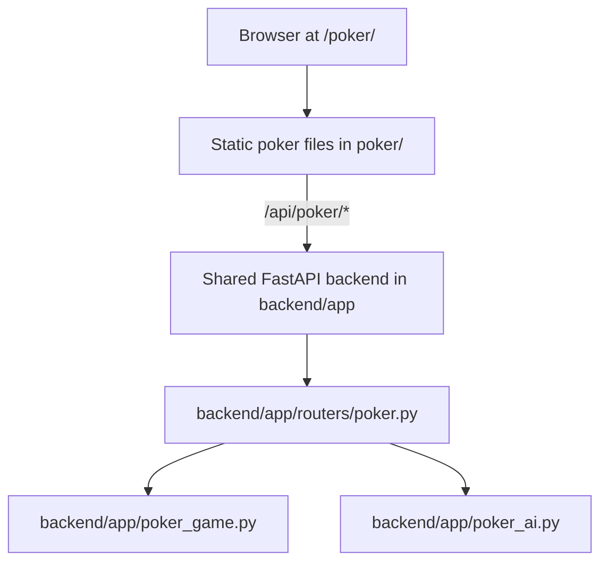
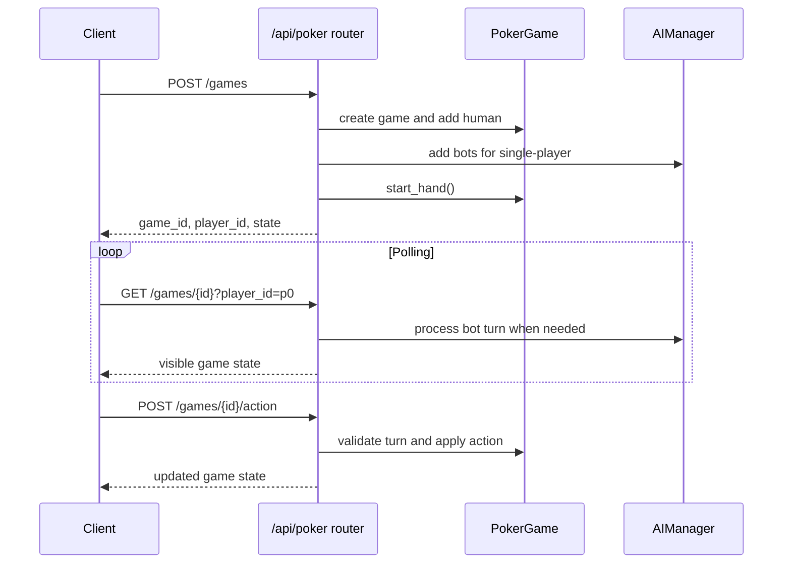

# Poker App Architecture

This document describes the poker app as it is wired in the current root site deployment.

**Last Updated:** May 9, 2026

## Active Runtime



Production Vercel serves the static frontend and rewrites `/api/*` to the Railway backend. Railway is built from the root `Dockerfile`, which copies `backend/` and runs `uvicorn app.main:app`.

## Repository Split

There are two poker backend code paths:

| Path | Status | Purpose |
| --- | --- | --- |
| `backend/app/routers/poker.py` plus `backend/app/poker_game.py` | Active in root deployment | Public poker API used by `/poker/`. |
| `poker/backend/` | Standalone/reference service | Richer poker backend with its own tests, config, persistence, analytics, tournaments, CSRF, and deployment files. It is not copied by the root Dockerfile. |

When changing production poker behavior, update the shared backend under `backend/app/` unless the deployment model is intentionally changed.

## Frontend

The active frontend is a static vanilla HTML/CSS/JS app:

- `poker/index.html` - markup and most CSS.
- `poker/app.js` - game UI, API calls, polling, stats, audio, haptics, themes, and multiplayer lobby flow.
- `poker/sw.js` and `poker/manifest.json` - PWA support.
- `poker/tests/` - Jest utility tests.

The frontend polls game state rather than using WebSockets. AI turns are processed by `GET /api/poker/games/{game_id}` when `process_ai=true`.

## Backend

The active shared router provides:

- Single-player games with five AI bots.
- Multiplayer lobby create/join/start.
- In-memory game storage.
- One-hour cleanup for inactive games.
- Player actions: fold, check, call, raise.
- Buy-back between hands.
- Next-hand flow after showdown.
- Basic poker health endpoint.

The active shared router does not provide tournaments, persisted games, chat endpoints, detailed health, analytics, backups, spectator endpoints, CSRF token issuance, or WebSockets.

## Data Flow



## Deployment

- Static frontend: served from `poker/` by Vercel/root static hosting.
- API: `/api/poker/*` is routed to the shared Railway backend.
- Auth: `/poker/*` and `/api/poker/*` are public.
- Persistence: active games live in process memory and do not survive backend restarts.

## Tests

Root JavaScript tests are run with:

```bash
npm test
```

The root Jest config currently includes `poker/tests`, `craps/tests`, and `blackjack/tests`.

The standalone backend under `poker/backend/` has its own pytest suite, but those tests target the standalone service rather than the active shared router.
