# Poker App Architecture

System architecture and design documentation for the Texas Hold'em Poker application.

**Version:** 1.0.7  
**Last Updated:** February 25, 2026

---

## System Overview

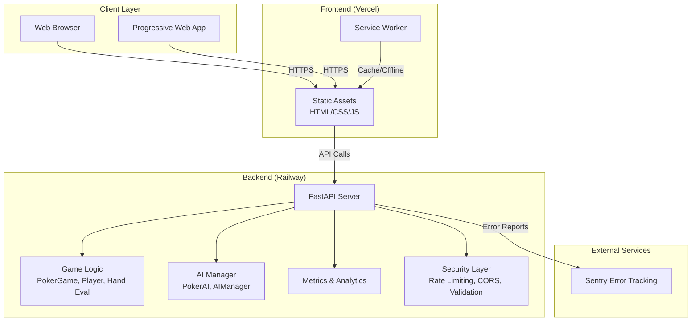

---

## Architecture Decisions

### 1. Polling over WebSockets

**Decision:** Use HTTP polling instead of WebSockets for real-time updates.

**Rationale:**
- Simpler deployment (no WebSocket server management)
- Better compatibility with serverless environments
- Easier caching and CDN integration
- Lower infrastructure costs

**Trade-offs:**
- Higher latency (~500ms-2s vs instant)
- More server load from frequent requests
- Mitigated by efficient game state serialization

**Future:** WebSocket support is planned for v2.0.

---

### 2. Monolithic Game State

**Decision:** Store entire game state in memory on a single server.

**Rationale:**
- Poker games are short-lived (1-2 hours max)
- Single game fits easily in memory (~50KB)
- No need for database complexity for MVP
- Fast read/write operations

**Trade-offs:**
- Games lost on server restart
- No horizontal scaling (single server)
- Limited to ~10,000 concurrent games

**Future:** Redis persistence and multi-server support planned.

---

### 3. AI as Server-Side Logic

**Decision:** Run all AI decision-making on the server.

**Rationale:**
- Prevents cheating (can't inspect AI logic)
- Consistent behavior across clients
- Easier to update AI without client updates
- Server has full game state context

**Trade-offs:**
- Higher server CPU usage
- Must optimize AI algorithms

---

### 4. Vanilla JavaScript Frontend

**Decision:** Use vanilla HTML/CSS/JS instead of React/Vue.

**Rationale:**
- Smaller bundle size (~50KB vs ~200KB+)
- Faster initial load
- No build step complexity
- Easier to optimize for performance

**Trade-offs:**
- Manual DOM manipulation
- No component reusability
- Harder to maintain at scale

---

## Component Architecture

### Backend Components

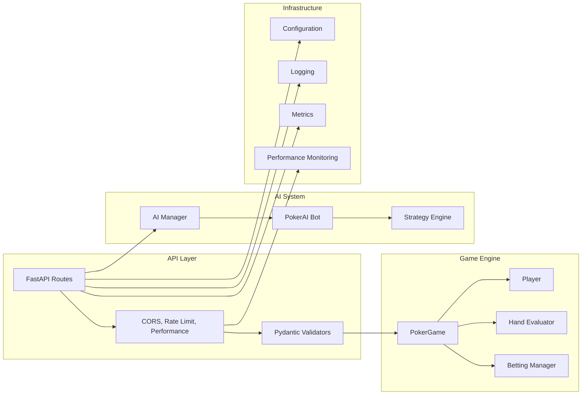

### Frontend Components

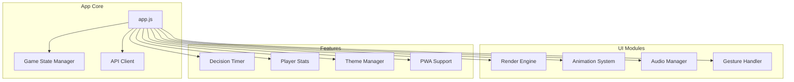

---

## Data Flow

### Game Creation Flow

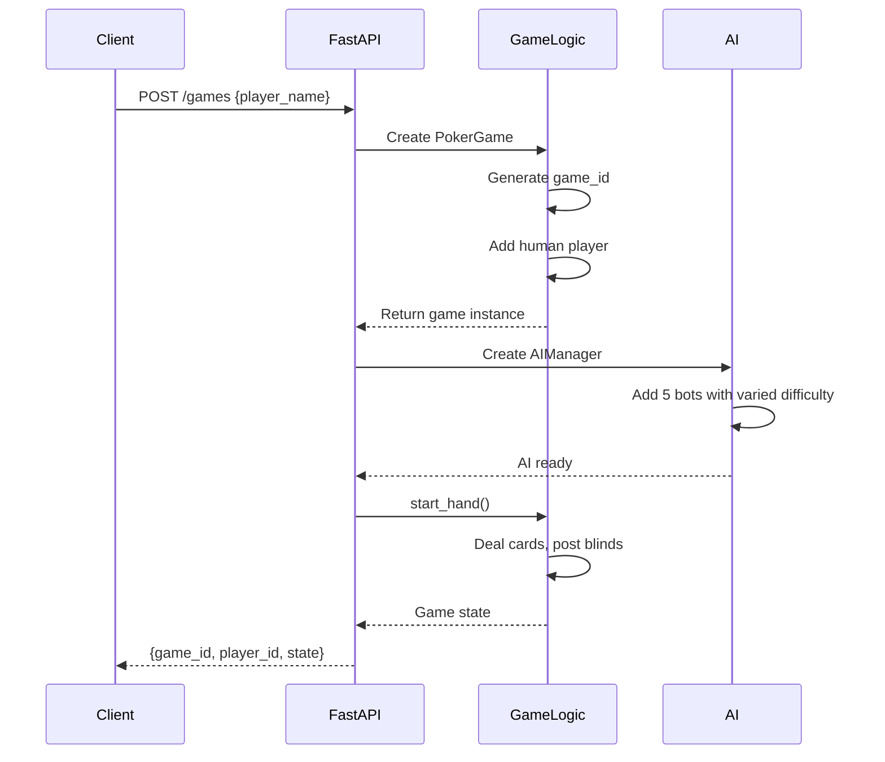

### Player Action Flow

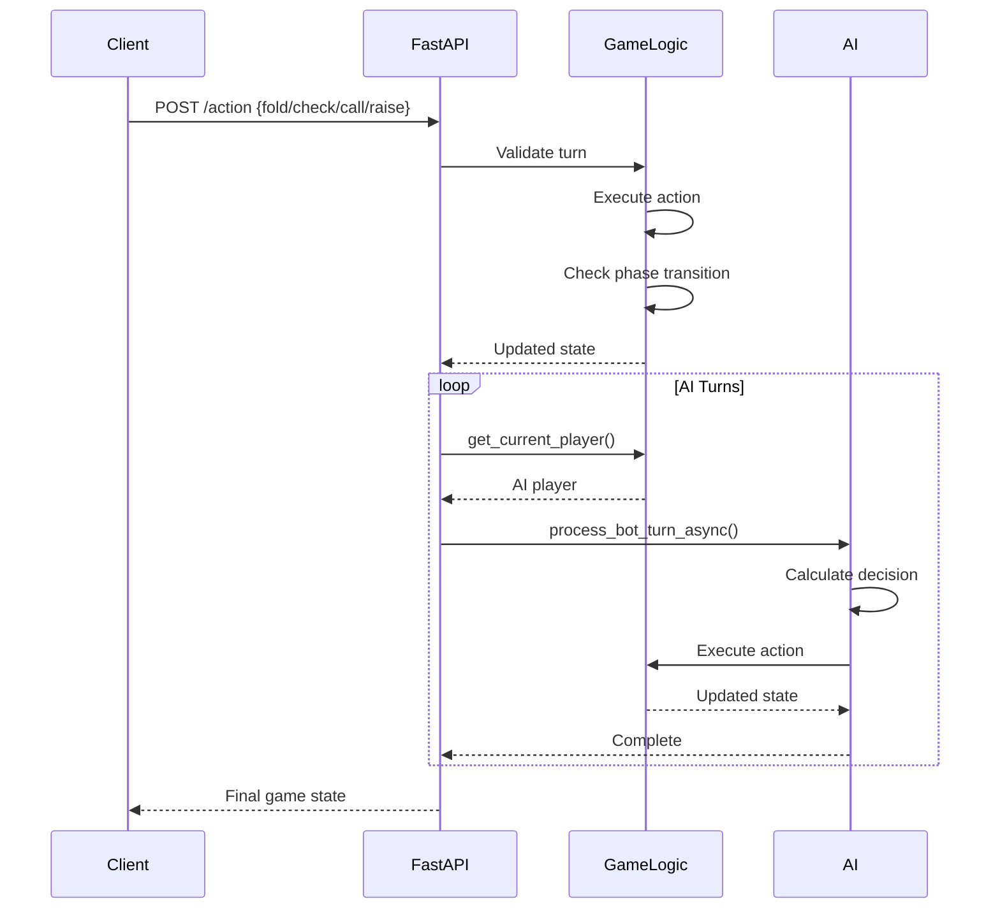

---

## Database Schema (Future)

When database persistence is implemented:

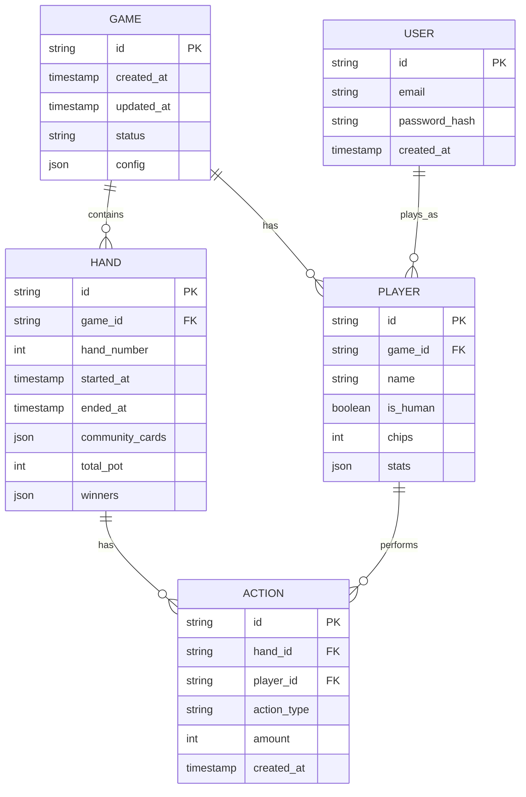

---

## Deployment Architecture

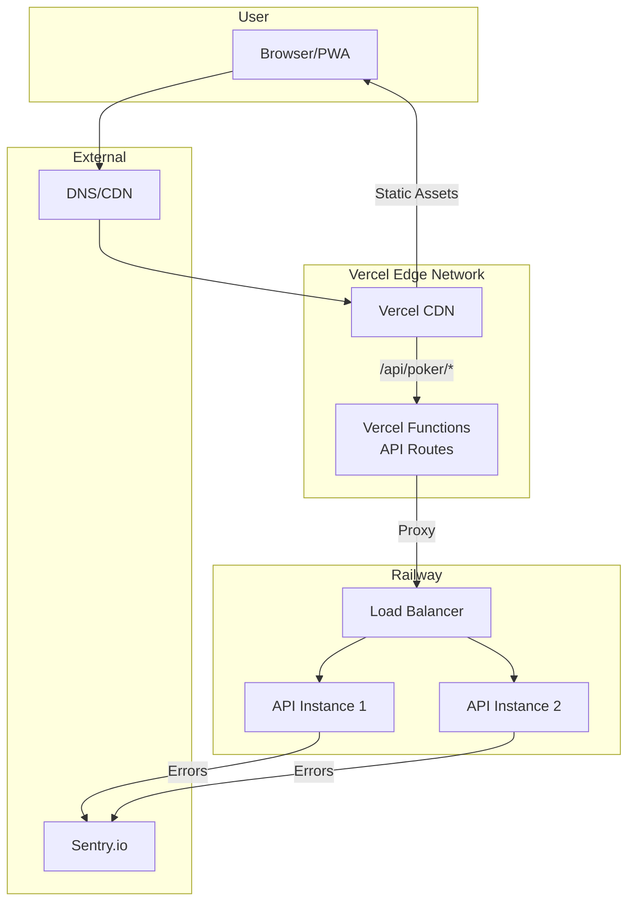

### Infrastructure Details

| Component | Provider | Purpose |
|-----------|----------|---------|
| Frontend Hosting | Vercel | Static assets, CDN, edge functions |
| Backend Hosting | Railway | FastAPI server, auto-scaling |
| DNS | Cloudflare | DNS, DDoS protection |
| Error Tracking | Sentry | Error monitoring, performance |
| Domain | Porkbun/Cloudflare | palmergill.com |

---

## Security Architecture

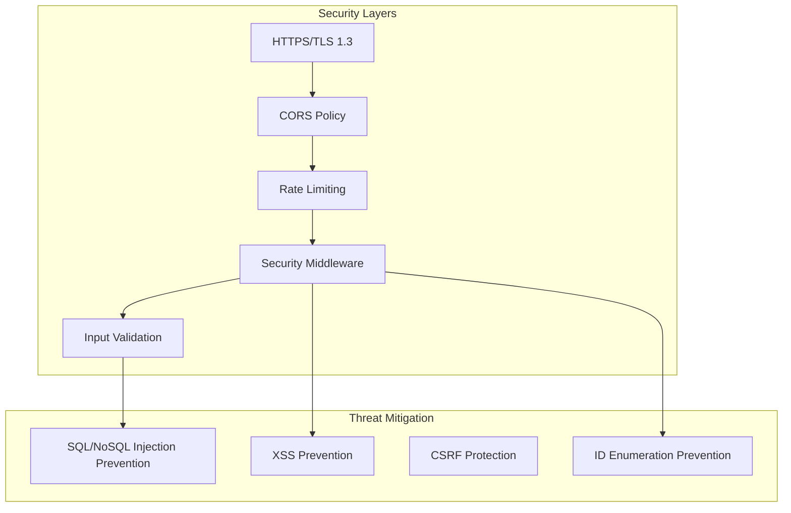

### Security Measures

1. **HTTPS Enforcement** - All traffic redirected to HTTPS in production
2. **CORS** - Configured to only allow palmergill.com origins
3. **Rate Limiting** - 20 req/min burst per IP
4. **Input Validation** - Pydantic validators on all inputs
5. **No Database** - In-memory only prevents injection attacks
6. **No Auth** - No session tokens to steal (stateless player IDs)

---

## Performance Optimizations

### Backend

- **Response Time:** <50ms average (p95 <150ms)
- **Game State Serialization:** Optimized dict conversion
- **AI Decisions:** <10ms per bot
- **Memory:** ~50KB per game
- **Cleanup:** Games auto-expire after 1 hour

### Frontend

- **Bundle Size:** ~50KB gzipped
- **First Paint:** <1s
- **Time to Interactive:** <2s
- **Polling:** 1s interval with backoff
- **Caching:** Service worker caches static assets

---

## Scaling Considerations

### Current Limits

- **Concurrent Games:** ~10,000 (memory constrained)
- **Requests/Second:** ~1,000 (CPU constrained)
- **Players per Game:** 6 (including human)

### Scaling Path

1. **Vertical Scaling** - Increase server RAM/CPU (current)
2. **Redis Persistence** - Store games in Redis for horizontal scaling
3. **WebSocket Server** - Separate WebSocket service for real-time
4. **CDN** - Cache static assets globally
5. **Multi-Region** - Deploy to multiple regions for lower latency

---

## Monitoring & Observability

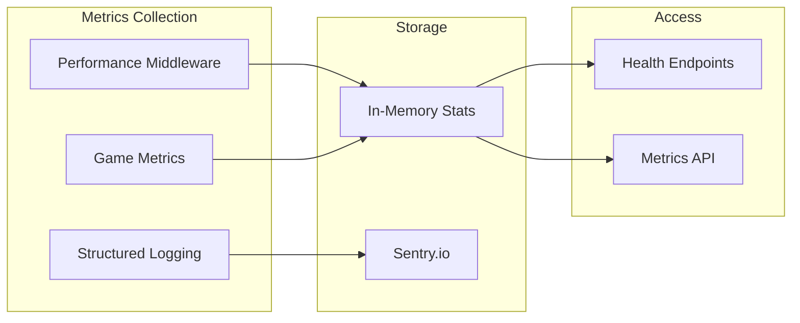

### Endpoints

- `/api/poker/health` - Basic health check
- `/api/poker/health/detailed` - System metrics
- `/api/poker/health/performance` - API performance stats
- `/api/poker/games/{id}/metrics` - Per-game analytics
- `/api/poker/games/{id}/ai-stats` - AI behavior stats

---

## Future Architecture (v2.0)

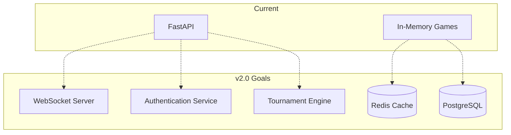

### Planned Features

1. **WebSocket Support** - Real-time updates
2. **Redis Persistence** - Game state survives restarts
3. **PostgreSQL** - Long-term storage for history/stats
4. **Authentication** - User accounts with JWT
5. **Tournament Mode** - Multi-table tournaments
6. **Spectator Mode** - Watch games without playing

---

## Development Workflow

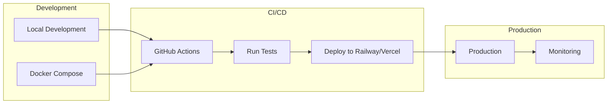

### Tech Stack

| Layer | Technology |
|-------|------------|
| Frontend | Vanilla HTML/CSS/JS |
| Backend | Python 3.11 + FastAPI |
| Testing | pytest |
| Deployment | Docker + Railway + Vercel |
| Monitoring | Sentry + Custom metrics |

---

## API Documentation

See [API.md](API.md) for detailed endpoint documentation.

---

## Contributing

See [CONTRIBUTING.md](CONTRIBUTING.md) for development setup and guidelines.
